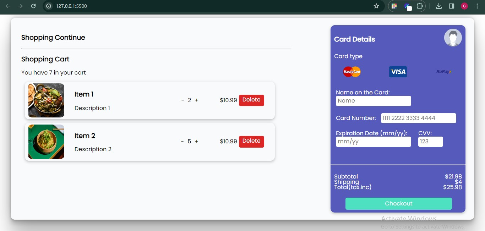

# Cartpage_Card

## Table of Contents

- [Deployed Link](#deployed-link)
- [How to Start the App](#how-to-start-the-app)
- [Frontend](#frontend)
- [Screenshots](#screenshots)
  - [Cart Page](#cart-page)
- [Tech Stack](#tech-stack)

## Deployed Link

1. Deployed link:

   https://658ed673f7667fb9261db622--coruscating-biscotti-ba2058.netlify.app/  

## How to Start the App

This is the Small MiniProject which Uses HTML5 and JavaScript , for building Modern Cartpage Card

## Frontend 

1. Clone the repository:

   ```bash
   git clone https://github.com/GaneshYadav3142/Cartpage_Cart.git

2. Run the live server, by clicking on Go Live button present in the bottom right corner of your VS code Editor

3. Start the App ,the app will run on port 127.0.0.1:5500


## Screenshots

### Homepage 




## Tech Stack

The app is built using the following technologies:

Frontend
1. HTML5
2. JavaScript
3. CSS3

